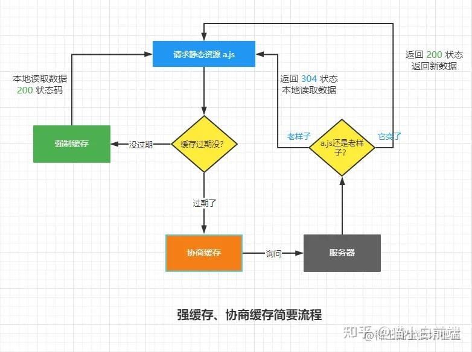

# CS Basic

## JS Basic

### Scope

3 types of JS scope

1. Global Scope

- Declared globally (outside any function)
- All scripts and functions on a web page can access it.

2. Function Scope

- Each function create a function scope
- Variables defined inside a function are not accessible (visible) from outside the function.

3. Block Scope

- Only after ES6
- Variables declared inside a `{}` block cannot be accessed from outside the block

### var, let & const

- const:
  - After ES6
  - Block Scope
  - Cannot be modified
- let:
  - Same with const, but can be modified
  - Cannot be re-declared
- var:
  - Global / Function Scope
  - Can be updated & re-declared
  - Hoisting of var
    ```
      console.log (greeter);
      var greeter = "say hello"
    ```
    equals to
    ```
      var greeter; // Initialized as undefined
      console.log(greeter); // greeter is undefined
      greeter = "say hello"
    ```

### this

“this”：对包含当前方法对象的引用，也就是 谁 运行的这个方法（call-site）

#### JS 运行流程

1.

## HTTP

### HTTP 访问控制

_跨域访问控制是浏览器行为，通过代理 / 工具即可绕过_

> [跨域到底是怎么回事-CORS 详解](https://ben-lau.github.io/%E8%B7%A8%E5%9F%9F%E5%88%B0%E5%BA%95%E6%98%AF%E6%80%8E%E4%B9%88%E5%9B%9E%E4%BA%8B-CORS%E8%AF%A6%E8%A7%A3/)

流程：

1. 发送请求
2. 根据同源策略进行判定

   同源，直接发送

   不同源，Request Header 携带 Origin（简单请求） / 预检请求 preflight（复杂请求）

3. 服务器接收请求，根据自身跨域设置，返回 Response Header，主要是 `Access-Control-Allow-origin` 字段（未配置跨域则无该 Header）
4. 浏览器接收响应，根据`Access-Control-Allow-origin`做匹配

   若无，直接拒绝

   若有，域名比对 & 其余判定。判定通过，则可发送请求

跨域相关 Header：

- `Access-Control-Allow-Origin`：允许跨域的`Origin`列表
- `Access-Control-Allow-Methods`：允许跨域的方法列表
- `Access-Control-Allow-Headers`：允许跨域的`Header`列表
- `Access-Control-Expose-Headers`：允许暴露给`JavaScript`代码的`Header`列表
- `Access-Control-Max-Age`：最大的浏览器缓存时间，单位为`s`

### Cookie

Cookie 是**服务器**发送到**浏览器**并在本地保存的一小块数据

基础用法：
`Set-Cookie: <cookie-name>=<cookie-value>`

### Web Storage

两种机制

- sessionStorage：
  - 会话级别，tab 关闭即销毁（有些保存会话的浏览器，重新打开后会话仍存在）
  - 容量比 cookie 大（5MB）
- localStorage：
  - 无过期时间，仅通过 js 获取 / 清除
  - 容量为 Browser cache / Locally Stored Data 中的较大值,可认为无上限

### HTTP 缓存机制

_缓存仅针对静态资源，因为相比于接口数据，静态资源大得多且不易更改_

> [强缓存 & 协商缓存](https://zhuanlan.zhihu.com/p/484262036#:~:text=%E5%BC%BA%E5%88%B6%E7%BC%93%E5%AD%98%20%E6%98%AF%E6%B5%8F%E8%A7%88%E5%99%A8,%E6%9C%8D%E5%8A%A1%E5%99%A8%E6%96%B0%E8%BF%94%E5%9B%9E%E7%9A%84%E6%96%87%E4%BB%B6%E3%80%82)



### MIME Type

| Type        | Description                                                             | Examples                                                                                                                                        |
| ----------- | ----------------------------------------------------------------------- | ----------------------------------------------------------------------------------------------------------------------------------------------- |
| text        | 表明文件是普通文本，理论上是人类可读                                    | `text/plain`, `text/html`, `text/css`, `text/javascript`                                                                                        |
| image       | 表明是某种图像。不包括视频，但是动态图（比如动态 gif）也使用 image 类型 | `image/gif`, `image/png`, `image/jpeg`, `image/bmp`, `image/webp`, `image/x-icon`, `image/vnd.microsoft.icon`                                   |
| audio       | 表明是某种音频文件                                                      | `audio/midi`, `vaudio/mpeg`, `audio/webm`, `audio/ogg`, `audio/wav `                                                                            |
| video       | 表明是某种视频文件                                                      | `video/webm`, `video/ogg`                                                                                                                       |
| application | 表明是某种二进制数据                                                    | `application/octet-stream`, `application/pkcs12`, `application/vnd.mspowerpoint`, `application/xhtml+xml`, `application/xml`, `application/pdf` |

```

```
